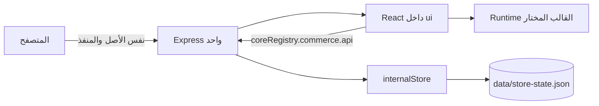

# دليل البنية الداخلية لمتجر القوالب

## الهدف

هذه الحزمة هي **مجلد متجر مستقل واحد**. تعمل الواجهة، المنطق التجاري والتخزين من عملية Express واحدة ومنفذ واحد. لا تحتوي MySQL أو Drizzle أو قاعدة بيانات خارجية أو Builder أو خدمة API مستقلة. مسارات `/api/*` داخلية للخادم ذاته وليست مشروعاً آخر.



## خريطة المجلدات

| المجلد | المسؤولية | قاعدة التعديل |
|---|---|---|
| `client/src/core/` | نقطة الدخول المشتركة Registry، الأنواع، التنقل، الإضافات، المال، عميل routes وعقود القوالب. | استورد منه بدلاً من ملفات core متفرقة. لا تضع JSX مرئياً فيه. |
| `client/src/ui/` | App وStorefront وحالة العرض وCSS العام. | يستهلك `coreRegistry` فقط للبنية المشتركة، ولا يملك اتصال ملفات/تخزين. |
| `client/src/store/` | مصدر البيانات القابل للتحرير للهوية والكتالوج والتشغيل والقالب. | عدّل البيانات هنا عند بناء متجر جديد. لا تحفظ أسراراً. |
| `templates/<id>/` | JSX الكامل وCSS responsive الخاص بكل قالب. | لا تعيد القوالب إلى factory مركزي أو لون مختلف فقط. |
| `server/` | Express و`internalStore` ومسارات التجارة. | لا يضع React أو أسرار متصفح. |
| `data/` | حالة تشغيل داخلية تنشأ تلقائياً. | لا تُرفع إلى Git؛ انسخها احتياطياً قبل النقل. |

## Registry Pattern

`client/src/core/registry.ts` هو واجهة الربط الموحدة. يصدر `coreRegistry` ويحتوي وحدات المتجر، navigation، plugins، commerce وtemplates. يستورد `ui/` هذه الواجهة فقط، وليس `api.ts` أو `money.ts` أو registry القوالب أو ملفات store كل على حدة. يُسجّل `core/registry.json` نقاط الدخول ومسارات النظام لتسهيل الفحص الآلي أو إضافة وحدة جديدة.

> عند إضافة دالة مشتركة، أضفها أولاً إلى وحدتها المتخصصة داخل `core/` ثم صدّرها من `coreRegistry`. لا تجعل `ui` يستوردها من مسار عميق.

## التخزين الداخلي

`server/internalStore.ts` يستخدم الملف `data/store-state.json` افتراضياً. يبذر المنتجات مرة واحدة من `client/src/store/catalog.ts`. عند checkout، يتحقق من بيانات العميل، يعيد قراءة السعر والمخزون من الحالة الداخلية، يجمع كميات المنتج المتكررة، يمنع تجاوز المخزون، ثم يسجّل الطلب وحركة المخزون داخل عملية كتابة متسلسلة. تُحفظ الحالة بملف مؤقت ثم `rename` ذري، فلا يصبح الملف نصف مكتوب عند نجاح النظام الطبيعي.

الملف المحلي مناسب لمتجر يعمل في جهاز أو خادم واحد ذو تخزين دائم. لا تشغّل نسختين من الخادم تشتركان في نفس ملف الحالة؛ استخدم عملية واحدة كما تقرره هذه الحزمة. في بيئة ملفات مؤقتة، ثبّت مجلد `data/` أو اضبط `STORE_DATA_FILE` على مسار تخزين دائم. انسخ الملف احتياطياً قبل التحديثات ولا تعدله يدوياً والخادم يعمل.

## تخصيص متجر جديد

ابدأ ببيانات `client/src/store/`: الهوية، النشاط، الكتالوج، العمليات والقالب. يجب أن يحمل المنتج صورة غلاف و`images` من 1 إلى 12 رابطاً بترتيبها الصحيح. اختيار القالب موجود في `template.ts`. القالب الحقيقي يملك navigation وhome وcatalog وproduct وcart وcheckout وCSS desktop/tablet/mobile داخل مجلده نفسه.

لا تنشئ مراجعات أو تقييمات أو شهادات عملاء مصطنعة. لا تقبل السعر أو الإجمالي من المتصفح؛ endpoint الطلب يستقبل IDs المنتجات والكميات والخيارات فقط ويحسب القيم داخلياً.

## التشغيل

```bash
cp .env.example .env
pnpm install --frozen-lockfile
pnpm dev
```

يبدأ خادم واحد على `http://localhost:3000`. للإنتاج: `pnpm build && pnpm start`. لا تحتاج إلى migration أو connection string أو proxy أو CORS أو نشر frontend مستقل.

## التحقق والإصدار

نفّذ `pnpm test` ثم `pnpm check` ثم `pnpm build`. اختبر المتجر على desktop وtablet وmobile: قائمة الهاتف، معرض الصور، الإضافة للسلة، تعديل الكمية، checkout الفارغ والخاطئ، نجاح الطلب والتتبع بالهاتف الصحيح والخاطئ. افحص `/api/health` ويجب أن يعرض `persistence: "internal"`.

قبل التسليم أنشئ ZIP للمجلد من دون `node_modules/` و`dist/` و`.env` و`data/`. أعد فكّه في مجلد نظيف، ثبّت الاعتمادات وشغّل الاختبارات والبناء. عند نسخة متجر جديدة، قدّم المصدر والـZIP، ولا تعيد Builder أو تبعية خارجية إلى الحزمة.
