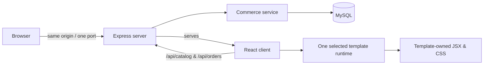

# دليل بنية متجر القوالب المستقل

## 1. الهدف وحدود النظام

هذا المشروع هو **متجر إلكتروني مستقل** موجه للسوق الجزائري. يضم المصدر الكامل للواجهة، منطق التجارة، قاعدة بيانات MySQL، القوالب وملفات الاختبار في مجلد واحد. لا توجد منصة إنشاء متاجر، ولا tenant، ولا خدمة frontend منفصلة، ولا API خارجية يجب نشرها بصورة مستقلة. يعمل العميل ومسارات التجارة من **عملية Express واحدة** ومنفذ واحد يحدد بالمتغير `PORT` أو يستخدم `3000` محلياً.

> واجهات `/api/*` هي مسارات داخل خادم المتجر نفسه وليست مشروع API أو خدمة منفصلة. لا تُحذف لأنها تنفذ الكتالوج والطلب والتتبع بأمان.



## 2. خريطة المجلدات

| المجلد أو الملف | المسؤولية | متى تعدّله |
|---|---|---|
| `client/src/core/` | أنواع المجال، عميل الاتصال الداخلي، تنسيق DZD، سجل القوالب والإضافات. لا يضع JSX مرئياً. | عند تغيير عقد البيانات أو منطق الاتصال المشترك. |
| `client/src/ui/` | نقطة تجميع التطبيق، حالة السلة والبحث والتنقل، وأنماط shell العامة. | عند تحسين تدفق المتجر المشترك أو حالة التحميل. |
| `client/src/store/` | بيانات المتجر القابلة للتعديل: الهوية، النشاط، العمليات، الكتالوج والقالب المختار. | عند تخصيص متجر جديد. |
| `templates/<template-id>/` | `runtime.tsx` و`runtime.css` اللذان يملكان الصفحات والتصميم responsive للقالب. | عند تغيير مظهر أو UX قالب بعينه. |
| `server/` | Express، التحقق، المخزون، الطلبات والتتبع. | عند إضافة قاعدة عمل أو route داخلي. |
| `drizzle/` | ترحيل جداول MySQL. | قبل تغيير مخطط قاعدة البيانات. |
| `.env.example` | قائمة متغيرات البيئة المطلوبة من دون أسرار. | عند إدخال تكامل خادمي جديد. |

## 3. طبقة `core`

طبقة `core` خالية من تفاصيل الواجهة المرئية. ملف `core/types.ts` هو مصدر الحقيقة لأنواع المنتج، المتجر، القالب والإضافة. يفرض المنتج اسمًا، slug فريدًا، السعر بـDZD، صورة غلاف، قائمة `images` مرتبة من 1 إلى 12 صورة، خيارات، تصنيفات وكمية مخزون. ملف `core/api.ts` هو العميل الوحيد لمسارات الخادم الداخلية؛ لا تبنِ طلبات `fetch` عشوائية داخل القوالب.

ملف `core/templates/registry.ts` يحصر القوالب المعروفة ويحمل runtime القالب المختار ديناميكياً. نتيجة ذلك أن الزائر ينزل JavaScript وCSS لقالب واحد فقط بدلاً من تحميل 24 واجهة معاً. عقد `core/templates/types.ts` يصف البيانات والأفعال التي يمكن أن يتلقاها runtime؛ لا يفرض بنية DOM أو أسلوب تنسيق مشترك على القوالب.

## 4. طبقة `ui`

`ui/App.tsx` يقرأ البيانات الصريحة من مجلد `store/`، يحمل عقد القالب المختار، ثم يمرر البيانات إلى `ui/Storefront.tsx`. يملك `Storefront` الحالة المشتركة غير المرئية: السلة، البحث، الحصول على كتالوج حي، حساب العناصر المختارة والتوجيه. لا ينشئ هذا الملف شبكة منتجات أو header أو checkout مرئي؛ هذه مسؤولية runtime القالب.

يحاول العميل قراءة الكتالوج من الخادم عند فتح المتجر، ثم يحتفظ ببيانات `store/catalog.ts` كحالة أولية متينة إذا لم تكن قاعدة البيانات متاحة بعد. لا ترسل الواجهة السعر أو الإجمالي كبيانات موثوق بها عند الطلب؛ ترسل فقط product ID والكمية والخيار وطريقة الشحن والدفع.

## 5. القوالب وملكية الواجهة

كل مجلد في `templates/` مستقل بصرياً. يحتوي `runtime.tsx` عناصره المملوكة فعلياً: التنقل، frame، البطاقات، home، catalog، product، cart، checkout والصفحات الثانوية. يحتوي `runtime.css` قواعد desktop وtablet وmobile وإتاحة التنقل المنهار لذلك القالب. لا تنقل قالباً إلى فرع if داخل `core` أو `ui`؛ انسخ مجلد قالب، غيّر الـID وJSX وCSS، ثم أضف loader واحداً في `core/templates/registry.ts`.

لا يجوز أن يكون اختلاف القوالب لوناً أو خطاً فقط. يجب أن يتغير ترتيب المعلومات، بنية بطاقة المنتج، navigation، hero، شبكة الكتالوج، عرض المنتج، ملخص السلة وتدفق checkout. حافظ على `data-owned-template` و`data-device-contract` لأنها أدلة اختبار ملكية القالب، وليست طبقة تصميم مشتركة.

## 6. البيانات وتخصيص متجر جديد

ابدأ بالتعديل في الملفات التالية، ولا تنشئ خدمة إعدادات زمن تشغيل:

| الملف | ما تضبطه |
|---|---|
| `client/src/store/identity.ts` | الاسم، domain، البريد، الشعار ووصف المتجر. |
| `client/src/store/business.ts` | اللغة المعروضة، السوق وقواعد النشاط المرئية. |
| `client/src/store/catalog.ts` | المنتجات، الصور، الخيارات، السعر والمخزون. |
| `client/src/store/operations.ts` | طرق الدفع والتوصيل، الرسوم ووضع إدارة المخزون. |
| `client/src/store/template.ts` | ID القالب، وصفه وخصائصه التحريرية. |

تأكد أن `template.id` يطابق اسم مجلد حقيقي في `templates/` ومفتاحاً في registry. ابدأ بكتالوج نظيف وواقعي؛ لا تضع مراجعات، تقييمات أو شهادات عملاء مصطنعة. بالنسبة للصور، استخدم روابط HTTPS مستقرة أو خدمة تخزين خاصة بك، وابقِ الصورة الأولى في `images` نفسها قيمة `image`.

## 7. الخادم وقاعدة البيانات

`server/index.ts` ينشئ تطبيق Express واحداً. في الإنتاج، يخدم ملفات `dist/client` ومسارات التجارة. في التطوير، يشغّل `server/dev.ts` Vite middleware داخل Express نفسه، وبالتالي يبقى الأصل والمنفذ والكوكيز متطابقين. لا تشغل Vite وExpress كخدمتين منفصلتين للمستخدم النهائي.

`server/storeService.ts` هو قلب التجارة. يقوم بالبذر الأولي من `store/catalog.ts`، يجلب المنتجات، ويتحقق من مدخلات checkout. عند وجود `DATABASE_URL` يستخدم transaction و`SELECT ... FOR UPDATE` لمنع بيع مخزون متزامن أكثر من المتاح؛ يحسب السعر من جدول `products`، ينشئ order وorder_items، يخفض المخزون ويسجل inventory movement. عند غياب قاعدة البيانات يعمل وضع `memory` المحلي فقط؛ يفقد البيانات عند إعادة التشغيل ولا يصلح لقبول طلبات حقيقية.

شغّل `pnpm db:migrate` بعد ضبط `DATABASE_URL` وقبل التشغيل الحقيقي. لا تغيّر جدولاً يملك بيانات مباشرة من دون ترحيل يحافظ على البيانات. اجعل كل تغيير في schema متبوعاً باختبار checkout ومخزون متزامن إن كان التغيير يؤثر على الطلبات.

## 8. المسارات الداخلية

| المسار | الاستخدام | الضمان |
|---|---|---|
| `GET /api/health` | فحص الجاهزية ووضع التخزين. | يكشف `mysql` أو `memory` صراحة. |
| `GET /api/catalog` | الكتالوج الحي. | يعيد المنتجات النشطة فقط. |
| `GET /api/catalog/:slug` | منتج واحد للصفحة التفصيلية. | يعيد 404 عند غياب المنتج. |
| `POST /api/orders` | تثبيت checkout. | يعيد حساب الإجمالي ويقفل المخزون داخل transaction. |
| `GET /api/orders/:reference?phone=` | تتبع طلب العميل. | يتطلب الرقم المرجعي والهاتف المطابق. |

لا تكشف أسرار بوابة الدفع للمتصفح. إذا أضفت دفعاً إلكترونياً، أنشئ adapter خادمياً مستقلاً وغيّر حالة الطلب إلى `paid` فقط بعد تحقق webhook موثوق وموقّع.

## 9. التشغيل والتطوير

```bash
cp .env.example .env
# اضبط DATABASE_URL في .env
pnpm install --frozen-lockfile
pnpm db:migrate
pnpm dev
```

يفتح المتجر على `http://localhost:3000` افتراضياً. لتشغيله على منفذ مختلف: `PORT=3100 pnpm dev`. في الإنتاج استخدم `pnpm build` ثم `PORT=3000 pnpm start`. لا تحتاج إلى proxy أو CORS أو نشر frontend منفصل؛ الواجهة والـroutes تأتي من المضيف نفسه.

## 10. الجودة والأداء والحماية

يحمّل registry runtime واحداً عند الطلب؛ احتفظ بهذه الخاصية ولا تستبدلها باستيراد 24 قالباً ثابتاً. لا تستورد صوراً ضخمة في JavaScript، استخدم صوراً محسّنة وlazy loading داخل runtime عند إضافة كتالوج كبير. لا تجعل summary السلة sticky على شاشة صغيرة إن كان يخفي زر checkout أو محتوى الإدخال، وحافظ على أزرار لمسية واضحة، focus ring، `aria-expanded` لقائمة الهاتف و`prefers-reduced-motion`.

يضع الخادم headers للحماية في الإنتاج، يقيد body إلى 64KB، يعطل `X-Powered-By` ويتحقق من الحقول من جديد. أضف rate limiting وحماية CSRF مناسبة قبل فتح متجر عام يستقبل طلبات حقيقية، واضبط logging من دون حفظ الهواتف أو العناوين كاملة في سجلات عامة.

## 11. فحوص الإصدار

قبل تسليم أو نشر أي متجر، نفّذ الخطوات التالية بالترتيب:

```bash
pnpm test
pnpm check
pnpm build
pnpm start
```

اختبر من المتصفح: فتح القالب المختار، التبديل بين صور المنتج، إضافة المنتج للسلة، تعديل الكمية، الانتقال إلى checkout، رفض بيانات ناقصة، إرسال طلب صالح، ثم تتبع الطلب بالهاتف الصحيح والخاطئ. اختبر desktop وtablet وmobile، خصوصاً قائمة الهاتف والملخص والتدفق الطويل. افحص `/api/health` للتأكد من أن الحالة `mysql` قبل قبول أي طلب حقيقي.

## 12. قاعدة العمل عند استخدام القوالب مستقبلاً

عند استلام طلب متجر جديد، اجمع أولاً هدف المتجر، البلد والعملة، الشريحة، المنتجات، الهوية، التسليم، الدفع، القالب والصفحات المطلوبة. لا تفترض هذه المعلومات. بعد اعتماد brief، اختر قالباً واحداً واكتب البيانات داخل `store/`، ثم عدّل runtime وCSS الخاصين به فقط، ووسّع `core` أو `server` فقط عند وجود قاعدة مشتركة حقيقية. انتهِ دائماً باختبارات وarchive نظيف للمجلد الواحد.
